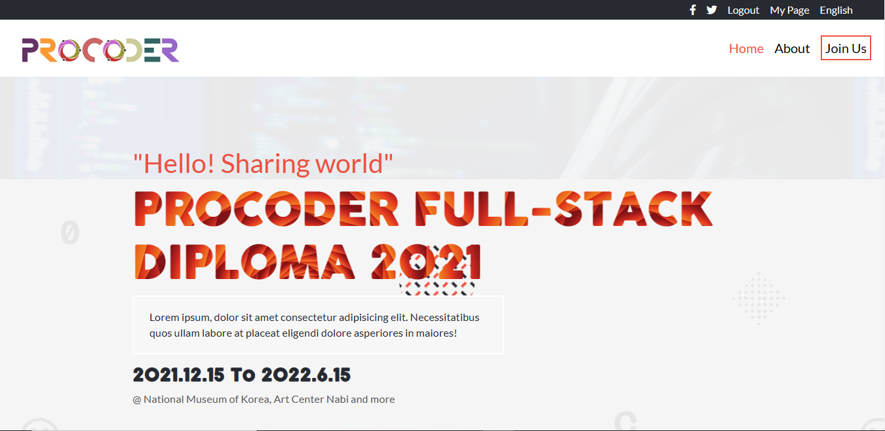

# My Portfolio

> This is my portfolio.

## Built With

- HTML
- CSS
- JS
- Bootstrap 5

## Live Demo
[Live Demo Link](https://keroloussamy.github.io/Module1-Capstone/)

## Video Demo
[Video Demo Link](https://www.loom.com/share/5b2f908082564d629f6bbb160fa773df)

## Getting Started

To get a local copy up and running follow these simple example steps.
1- Click on Code button.
2- Choose Download ZIP button. 

## Authors

👤 Kerolous Samy

- GitHub: [@kerolous](https://github.com/keroloussamy)
- Twitter: [@kerolous](https://twitter.com/SamyKerolous)
- LinkedIn: [kerolous](https://www.linkedin.com/in/keroloussamy/)

## 🤝 Contributing

Contributions, issues, and feature requests are welcome!

Feel free to check the [issues page](../../issues/).

## Show your support

Give a ⭐️ if you like this project!

## Acknowledgments

- Hat tip to anyone whose code was used
- Inspiration
- etc

## 📝 License

This project is [MIT](./MIT.md) licensed.
